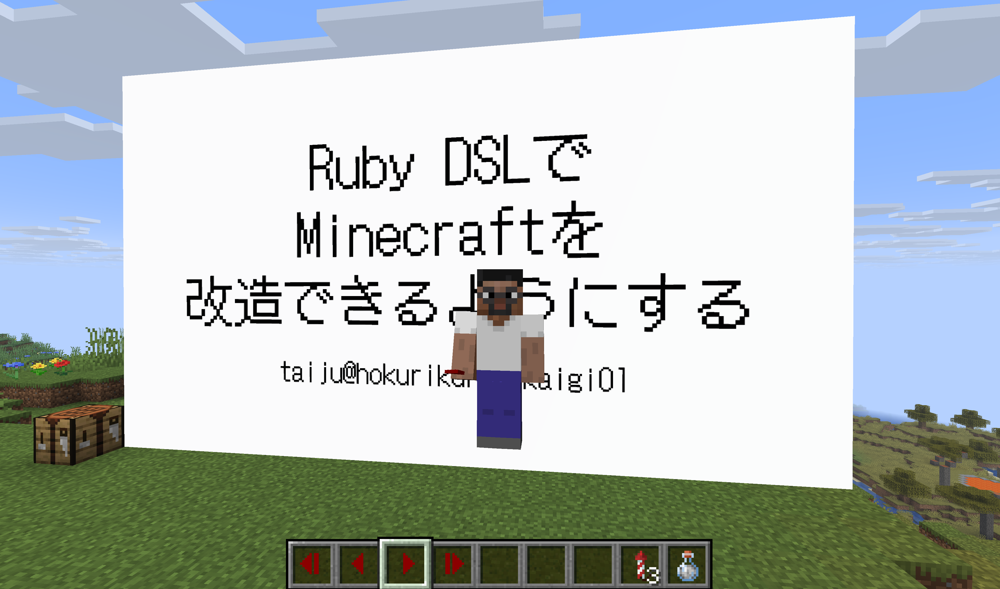

# Presentation Mod

A Minecraft mod that allows you to display image presentations in-game.



## About

This mod was created as a presentation tool for [a event](https://regional.rubykaigi.org/hokuriku01/), where the author actually used it to give a presentation in Minecraft.

## Installation

1.  Install [Minecraft](https://www.minecraft.net/).
2.  Install [NeoForge](https://neoforged.net/) (Version 21.8.51 or later).
3.  Build the mod from source:
    ```bash
    ./gradlew build
    ```
4.  The built jar file will be in the `build/libs/` folder.
5.  Place the jar file in your `mods` folder.

## Quick Start

The easiest way to create a presentation is to import it from a folder.

### 1. Prepare Images
1.  Go to your Minecraft instance folder.
2.  Navigate to `mods/presentation/`. (Create the folder if it doesn't exist)
3.  Create a new folder with your presentation ID (e.g., `my_presentation`).
4.  Put your slide images (`.png`) inside this folder.
    *   *Tip: Images are sorted alphabetically, so name them `01.png`, `02.png`, etc.*
    *   *Note: For multiplayer, all players need to have the same image files in their local `mods/presentation/` folder.*

### 2. Import Presentation
Run the following command to import the images as a presentation:

```
/presentation import my_presentation
```

This creates a presentation with the ID `my_presentation`.

### 3. Display Presentation
Stand where you want the presentation to appear and run:

```
/presentation set my_presentation ~ ~ ~ 3 4
```

*   `~ ~ ~`: The position (relative to you).
*   `3 4`: The width and height in blocks.
    *   *Tip: Use `16 9` for landscape images.*

### 4. Control Slides
You can control slides using commands or **Controller Items**.

**Using Controller Items:**
1. Get the items: `/presentation controller my_presentation`
2. You will receive 4 items:
    *   **Next Slide Switch**: Right-click to go to the next slide.
    *   **Previous Slide Switch**: Right-click to go to the previous slide.
    *   **Last Slide Switch**: Right-click to go to the last slide.
    *   **First Slide Switch**: Right-click to go to the first slide.

**Using Commands:**
*   **Next Slide**: `/presentation slide next my_presentation`
*   **Previous Slide**: `/presentation slide prev my_presentation`
*   **Last Slide**: `/presentation slide last my_presentation`
*   **First Slide**: `/presentation slide first my_presentation`

> [!TIP]
> You can use **Command Blocks** with buttons to control slides easily!
> 1. Give yourself a command block: `/give @s command_block`
> 2. Place it and set the command: `presentation slide next my_presentation`
> 3. Attach a button to the block.

> [!TIP]
> For a better viewing experience, switch to **Front Third Person view** (F5 twice) and apply the **Invisibility effect** (`/effect give @s invisibility`) if needed.

## Requirements

*   Minecraft: 1.21.8
*   NeoForge: 21.8.51

## Localization

This mod supports the following languages:

*   English (en_us)
*   Japanese (ja_jp)

The language is automatically selected based on your Minecraft language settings.

## Command Reference

### Management
*   `/presentation list`
    *   List all available presentations.
*   `/presentation remove <id>`
    *   Delete a presentation.
*   `/presentation import <id>`
    *   Import slides from `mods/presentation/<id>/`.
*   `/presentation controller <id>`
    *   Give yourself items to control the presentation (Next/Prev switch).

### Display
*   `/presentation set <id> <x> <y> <z> <width> <height>`
    *   Place the presentation in the world.
*   `/presentation unset <id>`
    *   Remove the presentation from the world (the data remains).

### Slide Control
*   `/presentation slide next <id>`
    *   Go to the next slide.
*   `/presentation slide prev <id>`
    *   Go to the previous slide.
*   `/presentation slide last <id>`
    *   Go to the last slide.
*   `/presentation slide first <id>`
    *   Go to the first slide.
*   `/presentation slide jump <id> <number>`
    *   Jump to a specific slide number.
*   `/presentation slide list <id>`
    *   List all slides in a presentation.

### Manual Editing (Advanced)
*   `/presentation add <id>`
    *   Create an empty presentation.
*   `/presentation slide add <id> [number] <filename>`
    *   Add a single slide.
*   `/presentation slide remove <id> <number>`
    *   Remove a single slide.
